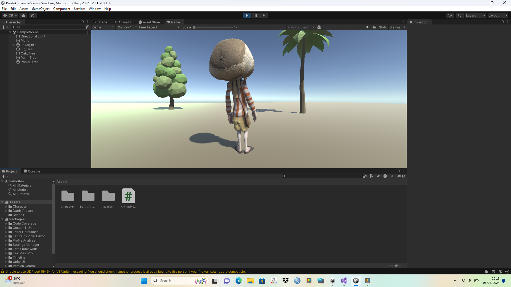
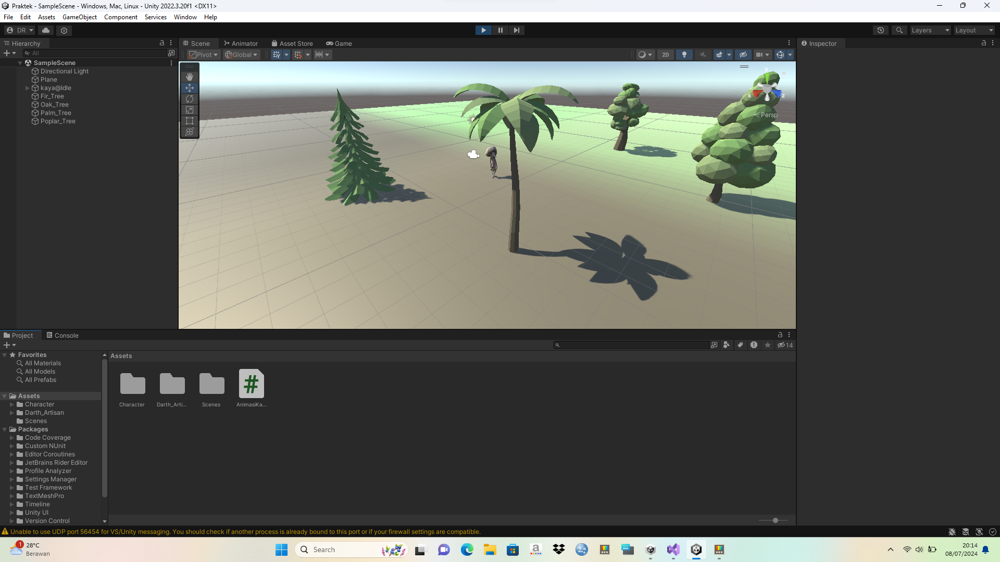

# pemrograman-5-game

Game 3D with unity
- [asset package](https://drive.google.com/file/d/186YyevO7WCvSZvlyWjwggONdDd_xXZh5/view?usp=sharing)
- [Vidio Game 3D](https://drive.google.com/file/d/1sS5mwTwP0HMWNzz-oc1c0KrdIEHzUNYZ/view?usp=sharing)

# cara bermain
gunakan tanda "panah atas" atau huruf "w" untuk berjalan, arah kanan dan kiri menggunakan tanda "panah kanan dan kiri" atau huruf "a" dan "d" serta untuk loncat menggunakan tombol "space"

